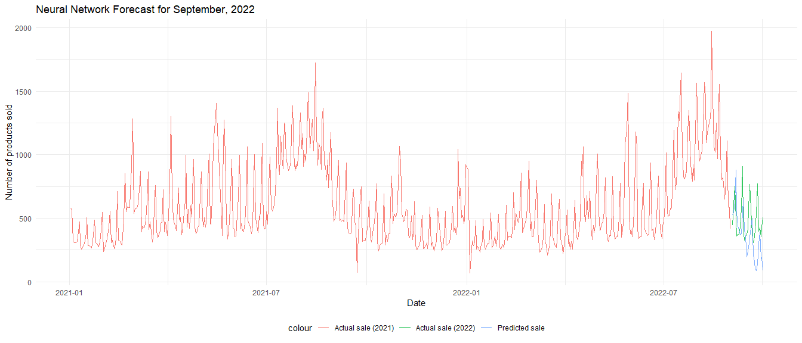

Forecast Model
================

``` r
knitr::opts_chunk$set(
  message = FALSE, 
  warning = FALSE,
  fig.width = 14,
  fig.height = 6,
  out.width = "90%")

library(tidyverse)
library(forecast)
library(astsa)
library(MLmetrics)
library(lubridate)
```

Time series forecasting involves using historical, time-stamped data to
make predictions of what might happen in the future.

Load and clean dataset:

``` r
bakery_df = 
  read_csv("./Data/Bakery_sales.csv") %>% 
  janitor::clean_names() %>% 
  mutate(
    unit_price = str_replace(unit_price, "€", ""),
    unit_price = str_replace(unit_price, ",", "."),
    unit_price = as.numeric(unit_price),
    year = year(date),
    month = month(date),
    hour = hour(time),
    product_name = article) %>% 
  filter(product_name != ".") %>% 
  select(-article)
```

In 2021, how many products were sold each day?

``` r
sale_2021 = 
  bakery_df %>% 
  filter(year == 2021) %>% 
  select(date, year, month, hour, product_name, quantity, unit_price) %>% 
  group_by(date) %>% 
  summarize(
    total_sale = sum(quantity))
```

In 2021, the bakery opened for business for 339 days. The `sale_2021`
dataset shows the number of products sold each day in 2021. To begin our
forecasting task, we need to convert the dataframe into a *time series*
or *ts* object.

Plot data on a line graph

``` r
sale_2021 %>% 
  ggplot(aes(x = date, y = total_sale)) +
  geom_line()
```


**Data pre-processing:**

``` r
sales_all = 
  bakery_df %>% 
  group_by(date) %>% 
  summarize(
    total_sale = sum(quantity))
```

``` r
train = 
  sales_all %>% 
  filter(date < "2022-09-01")

test = 
  sales_all %>% 
  filter(year(date) == 2022 & month(date) == 9)
```

## Seasonal Naive Model = Baseline Forecast

Naive forecasting is a simple and cost-effective method in which the
forecasts produced are equal to the last observed value. The seasonal
naive approach is used when the time series exhibits seasonality, in
which case, the forecasts are equivalent to the value from the last
season. Naive methods are typically used as a benchmark against which
more sophisticated forecasting techniques can be compared. For model
evaluation, we will be relying on the Mean Absolute Percentage Error
(MAPE) to measure the accuracy of our predictions.

``` r
seasonal_naive_model = snaive(train$total_sale, h = length(test$total_sale))

MAPE(seasonal_naive_model$mean, test$total_sale) * 100
```

    ## [1] 19.06633

``` r
test_seasonal = 
  test %>% 
  mutate(
    pred_sale = seasonal_naive_model$mean)
```

``` r
train %>% 
  ggplot(aes(x = date, y = total_sale)) +
  geom_line(aes(color = "Actual sale (2021)")) +
  geom_line(data = test_seasonal, aes(x = date, y = total_sale, color = "Actual sale (2022)")) + 
  geom_line(data = test_seasonal, aes(x = date, y = pred_sale, color = "Predicted sale"), size = 1.5) +
  labs(
    x = "Date",
    y = "Number of products sold",
    title = "Seasonal Naive Forecast for January, 2022")
```


This is the most shit forecast model…

## Double-Seasonal Holt-Winters (DSHW)

``` r
double_seasonal_model = dshw(train$total_sale, period1 = 7, period2 = 14, h = length(test$total_sale))

print("The error rate of this model is")
```

    ## [1] "The error rate of this model is"

``` r
MAPE(double_seasonal_model$mean, test$total_sale) * 100
```

    ## [1] 49.7216

``` r
test_double_seasonal = 
  test %>% 
  mutate(
    pred_sale = double_seasonal_model$mean)
```

``` r
train %>% 
  ggplot(aes(x = date, y = total_sale)) +
  geom_line(aes(color = "Actual sale (2021)")) +
  geom_line(data = test_double_seasonal, aes(x = date, y = total_sale, color = "Actual sale (2022)")) + 
  geom_line(data = test_double_seasonal, aes(x = date, y = pred_sale, color = "Predicted sale")) +
  labs(
    x = "Date",
    y = "Number of products sold",
    title = "Double-Seasonal Holt-Winters Forecast for January, 2022")
```


This model should be better than the basic one because it is dynamic,
but still shit because error is bigger than the basic one…

## TBATS

``` r
TBATS_model = tbats(train$total_sale)

tbats_df = forecast(TBATS_model, h = length(test$total_sale))

print("The error rate of this model is")
```

    ## [1] "The error rate of this model is"

``` r
MAPE(tbats_df$mean, test$total_sale) * 100
```

    ## [1] 42.06919

``` r
test_tbats = 
  test %>% 
  mutate(
    pred_sale = tbats_df$mean)
```

``` r
train %>% 
  ggplot(aes(x = date, y = total_sale)) +
  geom_line(aes(color = "Actual sale (2021)")) +
  geom_line(data = test_tbats, aes(x = date, y = total_sale, color = "Actual sale (2022)")) + 
  geom_line(data = test_tbats, aes(x = date, y = pred_sale, color = "Predicted sale"), size = 0.8) +
  labs(
    x = "Date",
    y = "Number of products sold",
    title = "TBATS Forecast for January, 2022")
```


Our model’s accuracy is getting better, but it tends to over forecast.
However, over forecasting can help the bakery to meet daily demand of
products…

## Neural Network

``` r
nn_model = nnetar(train$total_sale)

nn_forecast_df = forecast(nn_model, h = length(test$total_sale))

print("The error rate of this model is")
```

    ## [1] "The error rate of this model is"

``` r
MAPE(nn_forecast_df$mean, test$total_sale) * 100
```

    ## [1] 34.11401

``` r
test_nn = 
  test %>% 
  mutate(
    pred_sale = nn_forecast_df$mean)
```

``` r
train %>% 
  ggplot(aes(x = date, y = total_sale)) +
  geom_line(aes(color = "Actual sale (2021)")) +
  geom_line(data = test_nn, aes(x = date, y = total_sale, color = "Actual sale (2022)"), alpha = 0.8) + 
  geom_line(data = test_nn, aes(x = date, y = pred_sale, color = "Predicted sale"), size = 0.6, alpha = 0.8) +
  labs(
    x = "Date",
    y = "Number of products sold",
    title = "Neural Network Forecast for September, 2022") +
  theme_minimal() +
  theme(legend.position = "bottom")
```


