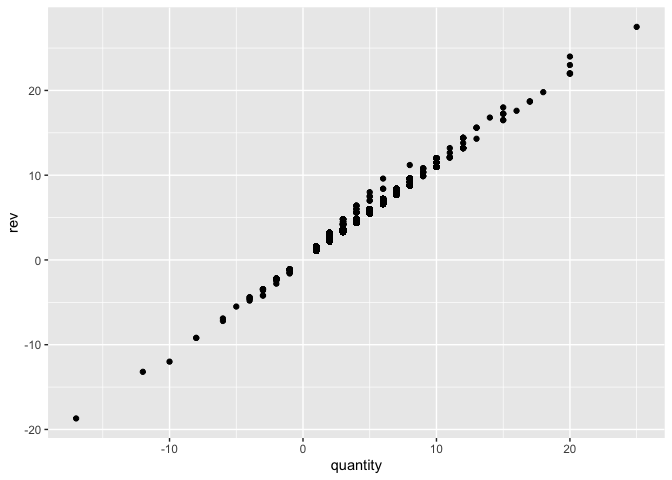
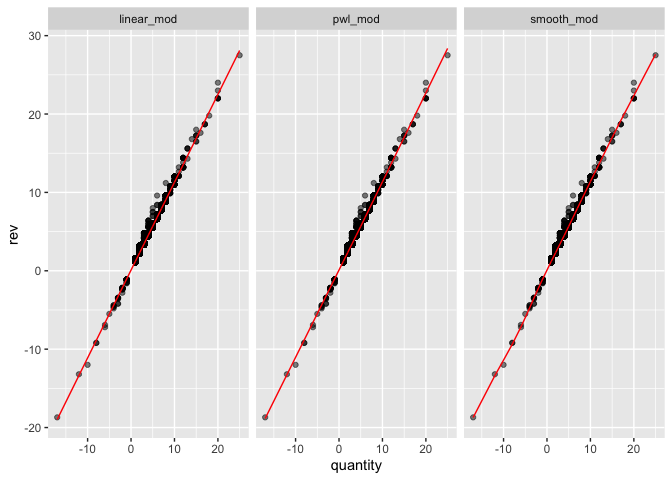
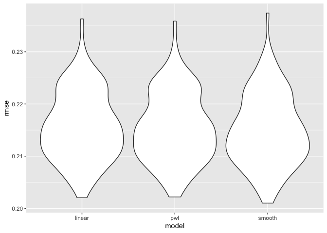
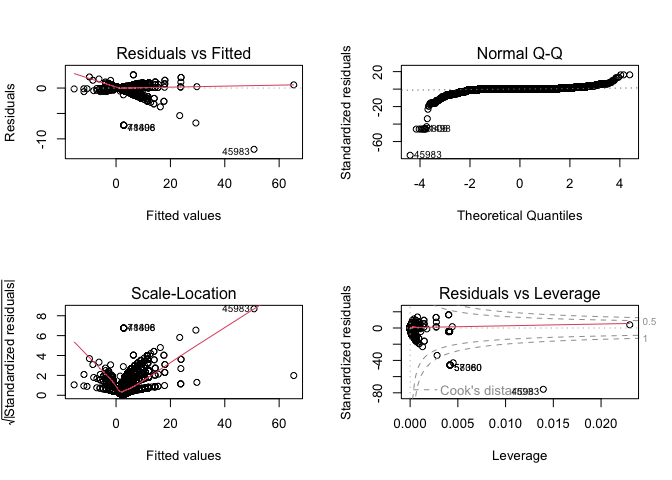
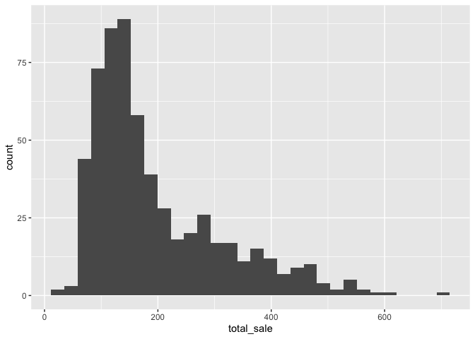
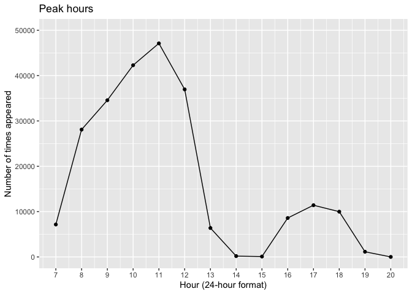
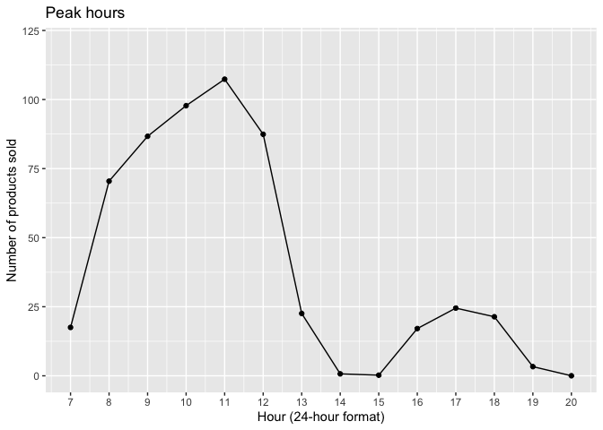
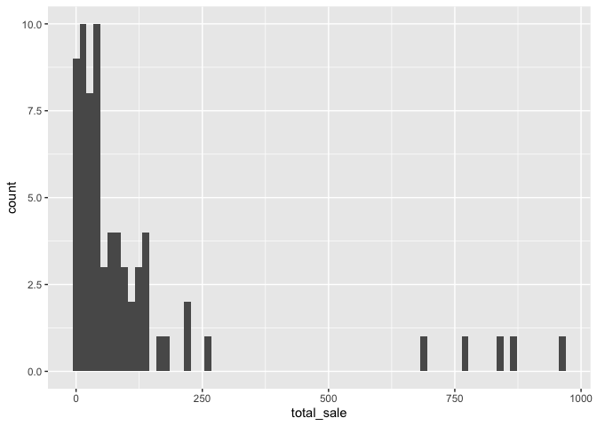

Tests & Analysis
================
Jiayi Yang, Chee-Kay Cheong
2022-12-05

``` r
knitr::opts_chunk$set(message = FALSE)

library(tidyverse)
```

    ## ── Attaching packages ─────────────────────────────────────── tidyverse 1.3.2 ──
    ## ✔ ggplot2 3.4.0      ✔ purrr   0.3.5 
    ## ✔ tibble  3.1.8      ✔ dplyr   1.0.10
    ## ✔ tidyr   1.2.0      ✔ stringr 1.4.1 
    ## ✔ readr   2.1.2      ✔ forcats 0.5.2 
    ## ── Conflicts ────────────────────────────────────────── tidyverse_conflicts() ──
    ## ✖ dplyr::filter() masks stats::filter()
    ## ✖ dplyr::lag()    masks stats::lag()

``` r
library(lubridate)
```

    ## 
    ## Attaching package: 'lubridate'
    ## 
    ## The following objects are masked from 'package:base':
    ## 
    ##     date, intersect, setdiff, union

``` r
library(plotly)
```

    ## 
    ## Attaching package: 'plotly'
    ## 
    ## The following object is masked from 'package:ggplot2':
    ## 
    ##     last_plot
    ## 
    ## The following object is masked from 'package:stats':
    ## 
    ##     filter
    ## 
    ## The following object is masked from 'package:graphics':
    ## 
    ##     layout

``` r
library(mgcv)
```

    ## Loading required package: nlme
    ## 
    ## Attaching package: 'nlme'
    ## 
    ## The following object is masked from 'package:dplyr':
    ## 
    ##     collapse
    ## 
    ## This is mgcv 1.8-40. For overview type 'help("mgcv-package")'.

``` r
library(moments)
library(modelr)
```

Data input and cleaning

``` r
bakery_df =
  read_csv("./Data/Bakery_sales.csv") %>% 
  janitor::clean_names() %>% 
  mutate(
    unit_price = str_replace(unit_price, "€", ""),
    unit_price = str_replace(unit_price, ",", "."),
    unit_price = as.numeric(unit_price),
    product_name = article, 
    rev = quantity * unit_price
    ) %>% 
  filter(product_name != ".") %>% 
  select(-article)

bakery_df
```

    ## # A tibble: 234,000 × 8
    ##       x1 date       time   ticket_number quantity unit_price product_name    rev
    ##    <dbl> <date>     <time>         <dbl>    <dbl>      <dbl> <chr>         <dbl>
    ##  1     0 2021-01-02 08:38         150040        1       0.9  BAGUETTE       0.9 
    ##  2     1 2021-01-02 08:38         150040        3       1.2  PAIN AU CHOC…  3.6 
    ##  3     4 2021-01-02 09:14         150041        2       1.2  PAIN AU CHOC…  2.4 
    ##  4     5 2021-01-02 09:14         150041        1       1.15 PAIN           1.15
    ##  5     8 2021-01-02 09:25         150042        5       1.2  TRADITIONAL …  6   
    ##  6    11 2021-01-02 09:25         150043        2       0.9  BAGUETTE       1.8 
    ##  7    12 2021-01-02 09:25         150043        3       1.1  CROISSANT      3.3 
    ##  8    15 2021-01-02 09:27         150044        1       1.05 BANETTE        1.05
    ##  9    18 2021-01-02 09:32         150045        3       1.2  TRADITIONAL …  3.6 
    ## 10    19 2021-01-02 09:32         150045        6       1.1  CROISSANT      6.6 
    ## # … with 233,990 more rows

### ANOVA

ANOVA tests whether there is a difference in means of the groups at each
level (each individual month) of the independent variable.

One way anova test can test if the mean sales of quarter 1 (Jan - Mar)
is different from the mean sales of quarter 3 (Jun - Aug).

The null hypothesis is that there is no difference in the mean sales of
1st quarter and 3rd quarter.  
The alternative hypothesis is that the means are different from one
another.

``` r
anova_df =
  bakery_df %>% 
  mutate(
    year = year(date),
    month = month(date)
    ) 
  

third_sales = 
  anova_df %>% 
  filter((month == 6)|(month == 7)|(month == 8)) %>% 
  group_by(year, month) %>% 
  summarize(third_sales = n()) %>% 
  group_by(year, month) %>% 
  mutate(ID = cur_group_id())
  
first_sales = 
  anova_df %>% 
  filter((month == 1) |(month == 2)|(month == 3)) %>% 
  group_by(year, month) %>% 
  summarize(first_sales = n()) %>% 
  group_by(year, month) %>% 
  mutate(ID = cur_group_id())
  
anova_test_df = 
  left_join(third_sales, first_sales, by = c("ID"))

anova_test_df
```

    ## # A tibble: 6 × 7
    ##   year.x month.x third_sales    ID year.y month.y first_sales
    ##    <dbl>   <dbl>       <int> <int>  <dbl>   <dbl>       <int>
    ## 1   2021       6       10856     1   2021       1        6562
    ## 2   2021       7       17592     2   2021       2        7817
    ## 3   2021       8       20344     3   2021       3        9233
    ## 4   2022       6       10678     4   2022       1        6273
    ## 5   2022       7       18242     5   2022       2        7795
    ## 6   2022       8       20135     6   2022       3        8251

``` r
one.way <- aov(first_sales ~ third_sales, data = anova_test_df)

summary(one.way)
```

    ##             Df  Sum Sq Mean Sq F value  Pr(>F)   
    ## third_sales  1 5350152 5350152   33.15 0.00451 **
    ## Residuals    4  645565  161391                   
    ## ---
    ## Signif. codes:  0 '***' 0.001 '**' 0.01 '*' 0.05 '.' 0.1 ' ' 1

The ANOVA test p-value is 0.00451 which is less than alpha level of
0.05, so we reject the null hypothesis and conclude that the mean sales
in quarter 1 is statistically significantly different from the mean
sales of quarter 3.

### Simple Linear Regression for croissant and test the model using Cross Validation

``` r
croissant_df = 
  bakery_df %>% 
  filter(str_detect(product_name, "CROISSANT")) %>% 
  mutate(
    month = month(date),
    qty_cp = (quantity > 5) * (quantity - 5)
    )

ggplot(croissant_df, aes(x = quantity, y = rev)) +
  geom_point()
```

<!-- -->

``` r
croissant_reg = lm(rev ~ quantity, croissant_df)

croissant_reg %>% 
  broom::tidy()
```

    ## # A tibble: 2 × 5
    ##   term        estimate std.error statistic   p.value
    ##   <chr>          <dbl>     <dbl>     <dbl>     <dbl>
    ## 1 (Intercept)   0.0863   0.00304      28.4 8.75e-172
    ## 2 quantity      1.12     0.00100    1121.  0

Examine cross validation of this simple linear regression model

``` r
linear_mod = lm(rev ~ quantity, croissant_df)
pwl_mod    = lm(rev ~ quantity + qty_cp, data = croissant_df)
smooth_mod = gam(rev ~ s(quantity), data = croissant_df)
```

``` r
croissant_df %>% 
  gather_predictions(linear_mod, pwl_mod, smooth_mod) %>% 
  mutate(model = fct_inorder(model)) %>% 
  ggplot(aes(x = quantity, y = rev)) + 
  geom_point(alpha = .5) +
  geom_line(aes(y = pred), color = "red") + 
  facet_grid(~model)
```

<!-- --> The three
models are very similar.

Re-sample the dataset by `crossv_mc` and let’s see the rmse of each
model

``` r
set.seed(2022)
cv_df =
  crossv_mc(croissant_df, 100) %>% 
  mutate(
    train = map(train, as_tibble),
    test = map(test, as_tibble))

cv_df = 
  cv_df %>% 
  mutate(
    linear_mod  = map(train, ~lm(rev ~ quantity, data = .x)),
    pwl_mod     = map(train, ~lm(rev ~ quantity + qty_cp, data = .x)),
    smooth_mod  = map(train, ~gam(rev ~ s(quantity), data = as_tibble(.x)))) %>% 
  mutate(
    rmse_linear = map2_dbl(linear_mod, test, ~rmse(model = .x, data = .y)),
    rmse_pwl    = map2_dbl(pwl_mod, test, ~rmse(model = .x, data = .y)),
    rmse_smooth = map2_dbl(smooth_mod, test, ~rmse(model = .x, data = .y)))
```

Then plot the rmse graph

``` r
cv_df %>% 
  select(starts_with("rmse")) %>% 
  pivot_longer(
    everything(),
    names_to = "model", 
    values_to = "rmse",
    names_prefix = "rmse_") %>% 
  mutate(model = fct_inorder(model)) %>% 
  ggplot(aes(x = model, y = rmse)) + geom_violin()
```

<!-- --> Based on the
results, there is a slightly improvement using piecewise linear model as
it has a lower tail of rmse on the top. Since there are no significant
difference between the three model including the non-linear smooth
model, we can conclude that the basic linear model is clear enough to be
accounted for this relationship in the product of croissant.

### Multiple Linear Regression (test version)

We are interested in testing the relationship between the unit price of
a product and its quantity being sold. Considering that the sales of
bakery varies by month, so we included `month` in our model as a
confounder to be controlled.

Linear Regression check assumption Linear Regression for baguette

``` r
baguette_df = 
  bakery_df %>% 
  filter(str_detect(product_name, "BAGUETTE")) %>% 
  mutate(
    month = month(date)
  )
baguette_reg = lm(rev ~ unit_price + quantity + month, baguette_df)

# Use backward elimination based on AIC to find a mlr model 
baguette_model_2 = step(baguette_reg, direction = "backward")
```

    ## Start:  AIC=-331778.6
    ## rev ~ unit_price + quantity + month
    ## 
    ##              Df Sum of Sq    RSS     AIC
    ## <none>                      2334 -331779
    ## - month       1         1   2335 -331742
    ## - unit_price  1      3987   6321 -241456
    ## - quantity    1    174518 176852   60583

``` r
summary(baguette_model_2) %>% broom::tidy() %>% knitr::kable(digits = 3)
```

| term        | estimate | std.error | statistic | p.value |
|:------------|---------:|----------:|----------:|--------:|
| (Intercept) |   -1.432 |     0.004 |  -374.606 |       0 |
| unit_price  |    1.207 |     0.003 |   393.521 |       0 |
| quantity    |    1.188 |     0.000 |  2603.542 |       0 |
| month       |    0.001 |     0.000 |     6.200 |       0 |

``` r
anova(baguette_model_2, baguette_reg)
```

    ## Analysis of Variance Table
    ## 
    ## Model 1: rev ~ unit_price + quantity + month
    ## Model 2: rev ~ unit_price + quantity + month
    ##   Res.Df    RSS Df Sum of Sq F Pr(>F)
    ## 1  90660 2334.1                      
    ## 2  90660 2334.1  0         0

``` r
baguette_reg %>% 
  broom::tidy()
```

    ## # A tibble: 4 × 5
    ##   term        estimate std.error statistic  p.value
    ##   <chr>          <dbl>     <dbl>     <dbl>    <dbl>
    ## 1 (Intercept) -1.43     0.00382    -375.   0       
    ## 2 unit_price   1.21     0.00307     394.   0       
    ## 3 quantity     1.19     0.000456   2604.   0       
    ## 4 month        0.00119  0.000193      6.20 5.69e-10

Examine assumptions for the chosen Linear Regression model

``` r
par(mfrow = c(2, 2))
plot(baguette_reg)
```

<!-- -->

### One-sample T-test

##### Regular Baguette (Two-sided)

We are interested in testing if the mean price of **regular baguette**
in this bakery is significantly different from the average price for a
baguette in Paris, which is 1.07 euros.

Null hypothesis: The mean price of baguette in this bakery is the same
as the average price of baguette in Paris.

Alternative hypothesis: The mean price of baguette in this bakery is
different from the average price of baguette in Paris.

``` r
bakery_df %>% 
  filter(product_name == "TRADITIONAL BAGUETTE") %>% 
  group_by(date) %>% 
  summarize(total_sale = sum(quantity)) %>% 
  ggplot(aes(x = total_sale)) +
  geom_histogram()
```

<!-- -->

``` r
baguette_onet = 
  bakery_df %>% 
  filter(product_name == "BAGUETTE") %>%
  select(unit_price)

baguette_t_results = 
  t.test(baguette_onet, mu = 1.07 , alternative = "two.sided") %>% 
  broom::tidy()
```

The p-value is much smaller than the alpha (0.05), so we would reject
the null hypothesis. At 5% level of significance, we have sufficient
evidence to conclude that the mean price of baguette in this bakery is
significantly different from the average price of baguette in Paris.

##### Traditional Baguette (One-sided)

We noticed that the price of traditional baguette in this bakery is
higher than the average price of traditional baguette in France. The
price of the traditional French loaf is around 0.90 Euros in bakeries.
Therefore, we would like to conduct a one-sided T-test to see if the
price difference is significant.

Null hypothesis: The mean price of traditional baguette in this bakery
is the same as the average price of traditional baguette in France.

Alternative hypothesis: The mean price of traditional baguette in this
bakery is higher than the average price of traditional baguette in
France.

``` r
bakery_df %>% 
  filter(product_name == "TRADITIONAL BAGUETTE") %>% 
  count(unit_price)
```

    ## # A tibble: 3 × 2
    ##   unit_price     n
    ##        <dbl> <int>
    ## 1       1.2  39426
    ## 2       1.25 13059
    ## 3       1.3  15204

``` r
trad_baguette_onet = 
  bakery_df %>% 
  filter(product_name == "TRADITIONAL BAGUETTE") %>%
  select(unit_price)

trad_baguette_t_results = 
  t.test(trad_baguette_onet, mu = 0.90, alternative = "greater") %>% 
  broom::tidy()
```

The p-value is much smaller than the alpha (0.05), so we would reject
the null hypothesis. At 5% level of significance, we have sufficient
evidence to conclude that the mean price of traditional baguette in this
bakery is significantly higher than the average price of baguette in
Paris.

### Generalized Additive Model

Find the *rush hours* of a typical day:

``` r
bakery_df = 
  bakery_df %>% 
  mutate(
    Hour = hour(time),
    Month = month(date))

bakery_df %>% 
  group_by(Hour) %>% 
  count() %>% 
  ggplot(aes(x = Hour, y = n)) +
  geom_point() +
  geom_line() +
  scale_x_continuous(breaks = seq(7, 20), limit = c(7, 20)) +
  scale_y_continuous(limit = c(0,50000)) +
  labs(
    title = "Peak hours",
    x = "Hour (24-hour format)",
    y = "Number of times appeared")
```

<!-- -->

Overall, what hours has the most number of products sold?

``` r
bakery_df %>% 
  mutate(year = year(date)) %>% 
  filter(year == 2021) %>% 
  group_by(Hour) %>% 
  summarize(
    n_sold = sum(quantity) / 365) %>% 
  ggplot(aes(x = Hour, y = n_sold)) +
  geom_point() +
  geom_line() +
  scale_x_continuous(breaks = seq(7, 20), limit = c(7, 20)) +
  scale_y_continuous(limit = c(0,120)) +
  labs(
    title = "Peak hours",
    x = "Hour (24-hour format)",
    y = "Number of products sold")
```

<!-- -->

``` r
smooth_mod = gam(quantity ~ s(Hour) + s(Month), data = bakery_df)

smooth_mod %>% broom::tidy()
```

    ## # A tibble: 2 × 5
    ##   term       edf ref.df statistic p.value
    ##   <chr>    <dbl>  <dbl>     <dbl>   <dbl>
    ## 1 s(Hour)   6.89   7.78     347.        0
    ## 2 s(Month)  8.89   9.00      46.6       0

``` r
bakery_df %>%
  mutate(
    month = month(date),
    year = year(date)) %>% 
  filter(month == 2 & year == 2021) %>% 
  group_by(product_name) %>% 
  summarize(total_sale = sum(quantity)) %>% 
  filter(total_sale < 1000) %>% 
  ggplot(aes(x = total_sale)) +
  geom_histogram(bins = 71)
```

<!-- -->

``` r
skew = 
bakery_df %>% 
  group_by(date) %>% 
  summarize(total_sale = sum(quantity))

# Skewness test
print(skewness(skew))
```

    ##        date  total_sale 
    ## -0.01517941  1.20058066
